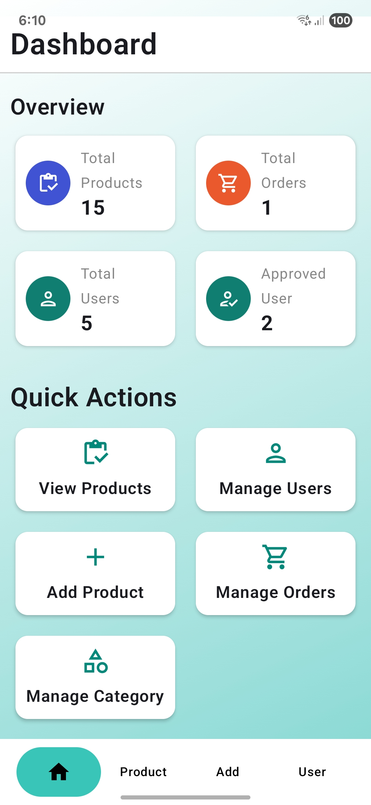
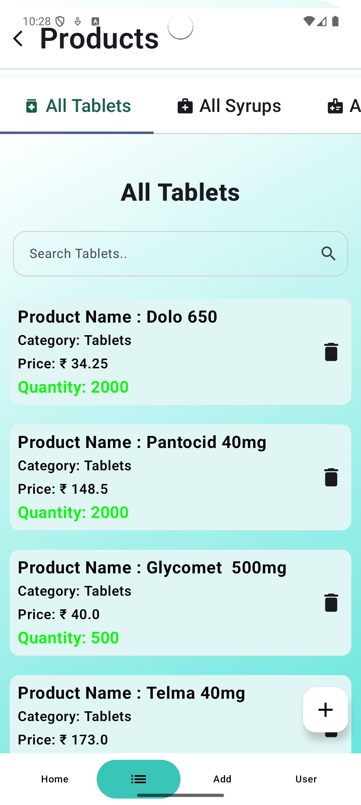
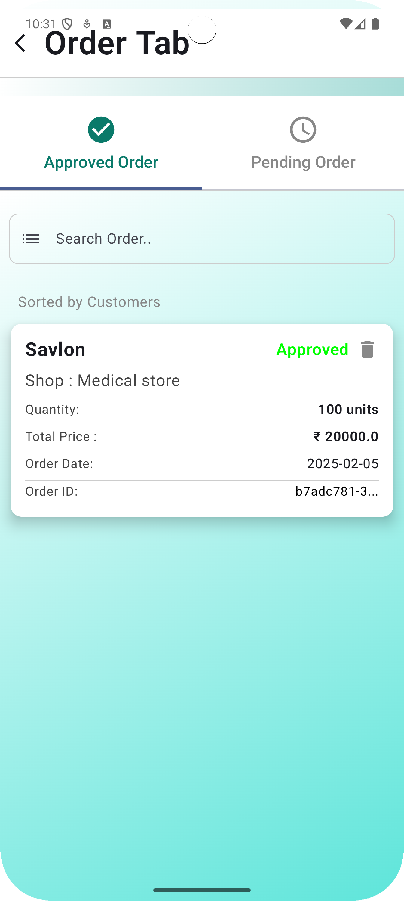

# 💊 PharmaConnect – B2B Medicine & Medical Equipment Ordering Platform  


PharmaConnect is a B2B Medicine & Medical Equipment Ordering Platform designed to seamlessly connect medical shop owners, wholesalers, and pharmaceutical companies.  

The solution is developed as **two separate Android applications**:  
- **Admin App** – For wholesalers/pharmaceutical companies to manage products, orders, and users.  
- **User App** – For medical shopkeepers/retailers to place orders and track deliveries.  

Built using **Kotlin**, **Jetpack Compose**, **REST APIs**, and **MVVM Architecture**, the system ensures smooth medicine & equipment ordering, real-time stock updates, and secure user approvals.

---

## 🚀 Features  
- 👤 **User Account with Approval** – Retailers/wholesalers must get admin approval before ordering.  
- 📦 **Product & Stock Management** – Admin can add, edit, or remove products in real-time.  
- 📜 **Order Management** – Track pending, approved, and completed orders.  
- 🔒 **User Control** – Admin can block/unblock users and manage access.  
- 📊 **Role-Based Dashboards** – Separate views for admin and users for clear workflows.  

---
## 📸 Screenshots  
 
The platform consists of **two separate apps** – **Admin App** (for wholesalers/pharma companies) and **User App** (for medical shopkeepers/retailers).  

---

### 📱 User App  
| Login & Approval | Product List | Order Screen | Order History |  
|------------------|--------------|--------------|---------------|  
|  |  |  |  |  

---

### 🖥 Admin App  
| Dashboard | Add Product | Product Listview | Order Management | User Approvals |  
|-----------|-------------|------------------|------------------|----------------|  
|  |  |  |  |  |  


---

## 🎥 App Preview (GIF)  
> Click here to watch the app demo on Google Drive  
[](https://drive.google.com/your-demo-link)  

---

## 🧰 Tech Stack  
- **Kotlin** – Programming language  
- **Jetpack Compose** – Modern declarative UI  
- **REST APIs** – For backend communication  
- **MVVM Architecture** – Scalable, maintainable code structure  
- **Hilt** – Dependency injection  
- **Coroutines & Flow** – Asynchronous data handling  
- **Flask API** – Centralized backend for data storage and operations  

---

## 🏗 Project Structure  
com.example.medicaladminapp and same for userapp 
├── api/       # API Builder & Service interfaces
├── common/    # Common utilities and constants
├── di/        # Dependency Injection modules (Hilt)
├── models/    # Data models
├── repo/      # Repository layer for data handling
├── screens/   # UI screens for products, orders, users
├── viewModel/ # ViewModels for business logic
└── ui.theme/  # App theming (colors, typography)

--

## 🛠 Installation Guide  

### Prerequisites:  
- Android Studio Hedgehog or later  
- Minimum SDK: 24 (Android 7.0)  
- Kotlin 1.9+  
- Active internet connection (for API calls)  

### Steps:  
1. Clone the repository:  
   ```bash
   git clone https://github.com/yourusername/medicart.git
Open in Android Studio.

Sync Gradle files.

Run the app on an emulator or physical device.

## 🚀 Future Improvements
- 🌙 **Dark Mode** – Light/Dark theme support  
- 📤 **Bulk Order Import** – Upload CSV for large orders  
- 🔔 **Push Notifications** – Order status updates  
- 🔐 **Advanced Authentication** – Two-factor verification  
- 📈 **Analytics Dashboard** – Sales insights
- 📜 **Order History** – Complete past order tracking  
- 💳 **Payment Integration** – Secure online payments for faster transactions   

## 🙌 Special Note
This app is developed as part of my academic and personal learning journey to build real-world, scalable B2B applications.  
It integrates **modern Android development tools** and follows **best practices in architecture**.  
In this project, I created my **own REST API using Flask** and learned how to integrate it into the Android app.  
The solution is designed as **two separate applications** – an **Admin App** for retailers and a **User App** for medical shopkeepers.  
Feedback and contributions are always welcome!
